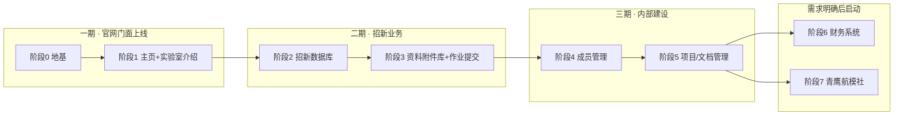

# FVIL 飞行器创新实验室官网建设计划

> 文档版本：v1.0（**决策已确认**）
> 文档状态：粗规划定稿，细规划已产出（见 §8）
> 项目根目录：`D:\HFUT\fvil`
> 技术基线：Django 5.2 + MySQL（本机 5.7 / 部署 8.0）

---

## 1. 项目目标与定位

为合肥工业大学飞行器创新实验室（FVIL）建设**官网 + 系列业务子系统**。网站是渐进式建设：

- **第一目标**：先有一个能上线的主页与实验室介绍，作为实验室对外门面（招新季宣传、成果展示、媒体矩阵入口）。
- **长期目标**：逐步扩展为实验室的综合业务平台——招新管理、培训资料库、成员管理、项目/文档管理、财务、下属社团等模块按需分期接入。
- **建设原则**：每个阶段结束都能独立上线、独立验收，不互相阻塞；优先保证"能跑起来、有人维护"，再谈功能完善。

## 2. 现状盘点（含工具链排查结果，2026-09-26 实查）

| 资产 | 位置/版本 | 说明 | 对官网的价值 |
|---|---|---|---|
| C 语言导学资料库（静态站） | `fvil-ec-guide\` | 8 篇导学案 + 作业 + 附录，markdown 真源 + `tools\build.js` 构建 | **按决策保留原模式**，官网侧另做附件 zip 上传下载（见阶段3） |
| Python | 3.10.0 @ `D:\Program Files\Python310` | 满足 Django 5.2 要求（3.10+） | 作为官网项目虚拟环境的基础 |
| Django 5.2 虚拟环境 | `D:\ProjectGroup\lDjango\dss01\.venv` | Python 3.10.0 + Django 5.2 | 已有可参考；官网项目**新建独立虚拟环境**，不混用 |
| MySQL | **5.7.21**（服务 `MySQL57` 运行中） | 与 Django 5.2 官方支持矩阵不匹配（见 §7 风险1） | 本机开发可用；**部署环境用 MySQL 8.0** |
| git | 资料库已用 git | — | 官网项目沿用 git 工作流 |

## 3. 需求全景与优先级

| 编号 | 模块 | 需求要点 | 建议优先级 | 阶段 |
|---|---|---|---|---|
| 1 | 主页 + 实验室介绍 | 概况、指导老师、实验室荣誉；抖音/B站官号展示 | **P0** | 阶段1 |
| 2 | 招新人员数据库 | 新生录入姓名/学号/年级/专业；成绩打分录入、数据处理；约200人/年，留10人 | **P0** | 阶段2 |
| 3 | 招新培训资料库 | **保留现有 markdown+构建模式**；Django 侧提供 pdf/代码等资料的 **zip 上传下载**；作业提交收 zip、人工批改 | **P1** | 阶段3 |
| 4 | 实验室成员简介 | 非紧急 | P1 | 阶段4 |
| 5 | 内部文档/项目管理系统 | 非紧急、困难 | P2 | 阶段5 |
| 6 | 财务系统 | 经费体系复杂，需求未理清 | P3 | 待定 |
| 7 | 青鹰航模社 | 业务属性未知 | P3 | 待定 |

**阶段路线图**



## 4. 总体技术方案

| 层面 | 选型 | 说明 |
|---|---|---|
| 后端框架 | Django 5.2（LTS） | 本机虚拟环境已确认可用 |
| 数据库 | 开发：本机 MySQL 5.7.21；**部署：MySQL 8.0** | 云服务器直接装 8.0，生产以 8.0 为准；开发避开 8.0 专属特性 |
| Python | 3.10.0 | 官网项目新建独立 venv（基于 `D:\Program Files\Python310`） |
| 数据库驱动 | **PyMySQL** | Windows 免编译；settings 中 `install_as_MySQLdb()` |
| 前端 | Django Templates + Bootstrap 5（本地 static，不用 CDN） | 服务端渲染；主页视觉按实验室蓝定制 |
| 管理后台 | Django Admin 打底 | 内容录入、成绩管理秒级可用；后期按需自定义 |
| 认证 | 仅管理组账号；**不做新生注册** | 人员以姓名+学号标识；成绩等数据仅管理员可写 |
| 文件存储 | 本地 MEDIA 目录 | 附件量小（每期≤10份作业+零散资料），无需对象存储 |
| 部署 | **阿里云服务器**（暂无域名，中期绑定） | 配置与代码分离（.env），为将来迁移学校服务器留路（见 §6-2） |
| 版本控制 | git | 建议建远程仓库（Gitee/GitHub） |

**Django 项目结构（单项目多应用）**

```
fvil/                        # 项目根
├─ manage.py
├─ config/                   # 项目配置（settings/urls/wsgi）
├─ core/                     # 主页、通用页面
├─ lab/                      # 实验室介绍（概况/老师/荣誉/媒体）
├─ recruitment/              # 招新（阶段2：报名/成绩/导出）
├─ doclib/                   # 资料附件库+作业提交（阶段3）
├─ members/                  # 成员管理（阶段4）
├─ projects/                 # 内部文档/项目（阶段5，后置）
├─ finance/                  # 财务（待调研）
├─ club/                     # 青鹰航模社（待调研）
├─ templates/ static/ media/
└─ docs/                     # 规划文档（本目录）
```

## 5. 各阶段交付物与验收标准

| 阶段 | 内容 | 交付物 | 验收标准 |
|---|---|---|---|
| **阶段0 地基** | 项目初始化、MySQL 连接、基础模板、git | 空壳项目跑通 | runserver 正常、后台可登录、迁移成功 |
| **阶段1 官网门面** | 主页 + 实验室介绍（概况/老师/荣誉/媒体矩阵） | 可对外访问的官网 | 页面完整、后台可改、手机端可看 |
| **阶段2 招新数据库** | 报名（姓名/学号/年级/专业）、批次管理、成绩录入、数据导出 | 可支撑一届招新的系统 | 新生能报名；管理员能录分；负责人能导出；越权被拦截 |
| **阶段3 资料库** | zip 附件上传下载 + 作业提交（zip、人工批改）；静态站保留 | 附件库 + 作业通道 | 管理员能传资料；学生能交作业；下载正常 |
| **阶段4 成员管理** | 成员简介展示、状态管理 | 成员页 | 信息可维护、按组展示 |
| **阶段5 项目/文档管理** | 内部项目列表、文档权限 | 内部工作台 | 需求细化后确定 |
| **阶段6/7** | 财务、航模社 | 需求调研 → 再排期 | 未启动 |

## 6. 已确认决策记录（负责人确认，2026-09-26）

| # | 决策点 | 结论 | 对设计的影响 |
|---|---|---|---|
| 1 | 部署环境 | 阿里云服务器；暂无域名（中期绑定，可规划运营） | 阶段0即做配置与代码分离 |
| 2 | 未来迁移学校服务器 | 不困难（详见 §6-2 说明） | 只需坚持 .env 配置分离 + 不硬编码路径 |
| 3 | 招新规模与权限 | 报名约200人/年、留约10人；指导老师2位不管项目，学生自治；管理权限学生≤20人 | 系统按单管理员+少量协管设计，无需复杂审批流 |
| 4 | 身份认证 | **不做新生注册**（避免常用密码泄露风险）；人员以姓名+学号标识；不要求高安全性 | 报名仅填表；成绩仅管理员录入；不引入邮箱验证等 |
| 5 | 作业提交 | 仅收压缩包（zip）；每期约10份；人工批改录入成绩 | 阶段3只做 zip 上传+下载+批改，不做在线判题 |
| 6 | 资料库模式 | **保留现有 markdown+构建模式**；另做 pdf/代码等资料 zip 上传下载；不传大型资料、不做完整项目上传 | 阶段3范围 = 附件库 + 作业通道，不做静态站迁移 |
| 7 | 视觉 | 延续实验室蓝（#1f6feb）；**无需英文页** | 模板配色、无 i18n 负担 |

### §6-2 关于"迁移到学校服务器"的说明

**结论：迁移不困难，属于"换台机器重新部署"，不是改造。** 前提是现在做好两件事：

1. **配置与代码分离**：密钥、数据库地址、DEBUG 等全部放 `.env` 环境变量，代码里不写死（阶段0就做）。
2. **不硬编码路径/域名**：上传文件用相对路径（MEDIA 目录随项目走），页面不写死 IP。

迁移时的实际工作量：
- 代码：git 拉到新服务器 + `pip install -r requirements.txt`（约 10 分钟）；
- 数据：MySQL `mysqldump` 导出 → 新服务器导入（招新数据、内容数据全在数据库里）；
- 文件：`media/` 目录整体拷贝（作业附件、图片）；
- 域名：中期绑定时在 DNS 加一条解析指向新服务器即可，与架构无关。

唯一要注意的是学校服务器可能在内网/有特殊端口策略，那是部署细节，到时候单独处理，不影响现有代码。

## 7. 风险与开放问题

| 风险/问题 | 影响 | 对策 |
|---|---|---|
| **MySQL 5.7 与 Django 5.2 不匹配** | 见下 | 开发期可用；**部署用 8.0**；避开 8.0 专属特性 |
| 成绩/人员数据敏感 | 越权泄露 | 权限模型从阶段2建立；管理组账号受限（≤20人） |
| 文件上传安全 | 恶意文件 | 扩展名白名单（zip/pdf/c）+ 大小限制 |
| 数据丢失 | 招新数据不可逆 | 上线后 MySQL 定时备份 |
| 一人开发、时间不可控 | 进度拖延 | 阶段拆小、每阶段独立验收 |
| 财务/航模社需求不明 | 盲目开工返工 | 不排期，先需求调研 |

### 关于 MySQL 5.7.21 + Django 5.2 的说明（风险1详述）

- **不会跑不起来**：Django 5.2 官方支持的 MySQL 版本是 **8.0.11+**，5.7 不在支持列表（Django 5.0 起移除），但连接、建表、增删改查等基础功能在 5.7 上**可以正常工作**，Django 不会拒绝连接。
- **需要注意的限制**：
  1. **检查约束（CheckConstraint）不可用**：MySQL 8.0.16 以下不支持 CHECK 约束，模型里用了会在迁移时报错——规划中明确**不用**即可；
  2. MySQL 8 的部分新特性（函数索引、部分索引等）在 5.7 不可用，**避开**；
  3. JSONField 在 5.7.8+ 可用，但 8.0 更完善，非必须不用；
  4. Django 团队不为 5.7 做测试，遇到边角问题需自行排查。
- **另一个现实问题**：MySQL 5.7 官方已于 2023 年 10 月停止维护（不再有安全补丁）。
- **结论（建议）**：本机 5.7 先顶着开发（够用）；**阿里云部署时直接装 MySQL 8.0**，生产以 8.0 为准；开发期间 ORM 写法保持通用（不用 CheckConstraint 等 8.0 专属特性），这样本机 5.7 与生产 8.0 之间的行为差异几乎为零。若开发中真遇到 5.7 的坑，再升级本机（备份→装 8.0→导入），不阻塞主线。

## 8. 下一步

- ✅ 粗规划定稿（本文件 v1.0）
- ✅ **细规划已产出**：`docs\FVIL官网建设计划-细规划-阶段0-1.md`（阶段0+阶段1 可执行清单，含阶段2招新数据模型草案）
- 待负责人确认后即可按细规划开工

---

*合肥工业大学 飞行器创新实验室（FVIL）· 官网建设项目*
